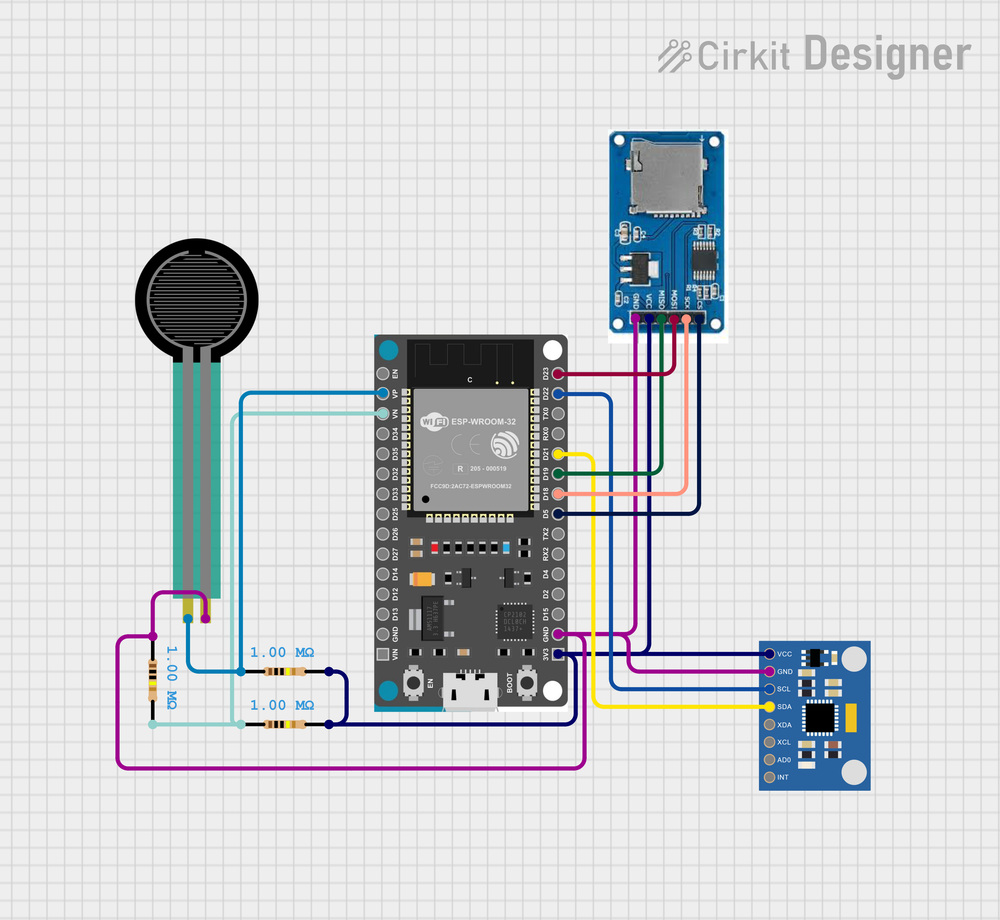
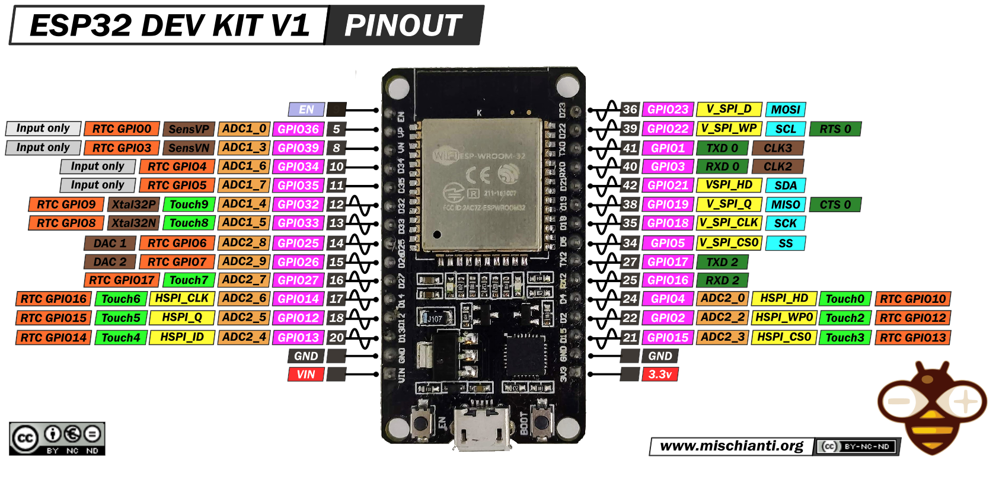
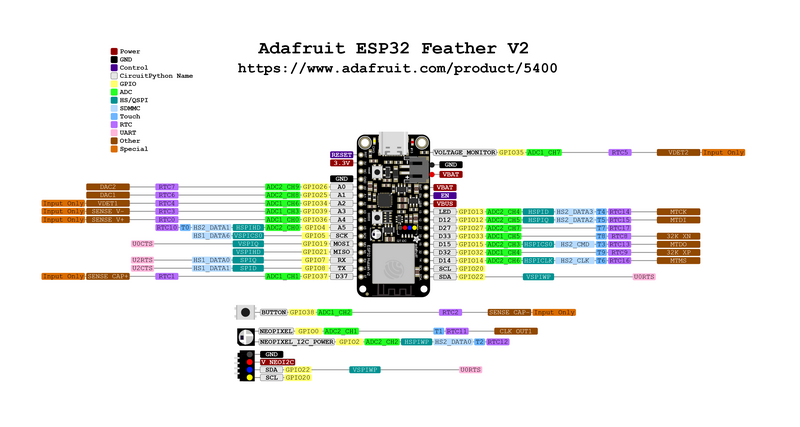

# Circuit
https://app.cirkitdesigner.com/project/71fc41e8-6a78-4813-9acc-cf6826728f7b



datasheets for both our boards:



# IMU Form code

- Data in `data` folder. 
- MATLAB scripts in `analysis_scripts` folder. 
- Python in `sensor_scripts` folder.

## how data is processed
`ML_run.m` will take a file in the `data` folder and send it to be processed by `decode_sensor_bin.py`

`decode_sensor_bin.py` will call the rest of the python files, do some magic and output a csv file to the `data` folder.

`read_data.m` is called by `ML_run.m` to turn the csv into a MATLAB dataframe.

if you want to run the python code without MATLAB i believe you need to manually set `ext` to the file extension and `filename` to the file name, and the press run:


# Force Sensor files

In the folder called `force_sensor`

# ESP IMU's


## how we fixed esp issues
- Making the adafruit work requries specific drivers. steps:
```
Physically Connect the Adafruit ESP32
Opened the Arduino IDE.
Went to File > Preferences (or Arduino > Preferences on macOS).
Added this URL in the Additional Board Manager URLs field:
https://raw.githubusercontent.com/espressif/arduino-esp32/gh-pages/package_esp32_index.json 
(Separated it with a comma if other URLs were already present.)

Went to Tools > Board > Boards Manager.
Searched for ESP32.
Clicked Install next to the "esp32 by Espressif Systems" package (v3.1.1).
Went to Tools > Board and selected Adafruit Feather ESP32 V2 from the list.
Went to Tools > Port and selected the correct COM port (you can check device manager to see which COM port you’re using for the ESP32)


After this, go to the top tab and click 
“Tools”, then Go to Sketch > Include Library > Manage Libraries.
Search for MPU6050 in the Library Manager.
If first time set up, install the Adafruit MPU6050 library (It will prompt you to install the dependencies, make sure you do that too). Ask chatGPT how to install an arduino library if you forgot it’ll tell you exactly what to click.

You can do a simple code to make sure i2c is connected: (assuming the MPU 6050 is already physically connected to the adafruit esp32).

Go to the git repo we have for FORM, then under `esp IMU`, copy the code in the .ino file (there should be only 1 ino file) into arduino IDE, then upload the code onto your esp32.

You can double check in serial monitor (baud rate MUST be 115200) to see the output, but this step in my opinion you should skip, can just go straight to the python part.

Now, in powershell, cd into the same analysis_scripts folder. 
Now, run ‘python imucollect.py <seconds to sample>’ here. 

It SHOULD now store all 6 axis into the `/analysis_scripts/data` , but I found that I need to click the reset button on the esp32 sometimes while the script is running which is annoying, but click that button and then start doing some circles (you should see some numbers changing hopefully)

Now you have the time stamped data in $STEM/analysis_scripts/data.
Now from here you can run the python notebook.

```


