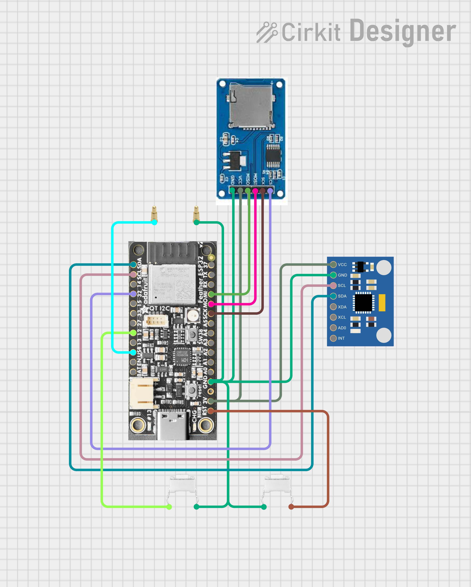
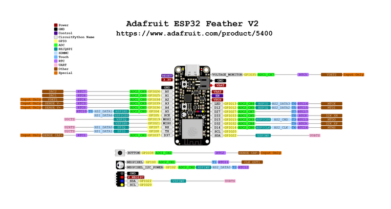

# FORM24

A device for IMU-based swimming stroke rate analysis using ESP32 microcontrollers.

## Overview

This system captures, processes, and analyzes motion data using ESP32 microcontrollers and IMU sensors. This repository contains the core codebase for operating the FORM24 device.

> **Note:** For experimental and prototype code, please see the [archive documentation](archive/README.md).

## Core Components

The system consists of three main components:

1. **Firmware** - [`core/imuLoggerAndTransfer.ino`](core/imuLoggerAndTransfer.ino)
   * ESP32 firmware for data collection and transmission
   * Handles IMU sensor communication
   * Manages Bluetooth connectivity
   * Includes button functionality for start and stop logging control (board will work without buttons)

2. **Control Interface** - [`core/bleClientGUI.py`](core/bleClientGUI.py)
   * Python GUI for device control
   * Connects to the ESP32 via Bluetooth
   * Handles data download and management

3. **Data Processing** - [`core/imuProcess.ipynb`](core/imuProcess.ipynb)
   * Jupyter notebook for analyzing collected data
   * Performs signal processing and feature extraction
   * Generates visualizations and metrics

## Quick Start Guide

### Hardware Requirements

* ESP32 microcontroller (ESP32FEATHERV2)
* MPU6050 IMU sensor
* SD card module with formatted SD card (for data logging)
* Push button (optional for manual control)
* USB cable for programming

### Setup Instructions

#### 1. ESP32 Setup

1. Install the Arduino IDE
2. Add ESP32 board support via Boards Manager
3. Install required libraries:
   * Adafruit MPU6050
   * BLE libraries
4. Upload `imuLoggerAndTransfer.ino` to your ESP32

#### 2. Control Software Setup

1. Install Python dependencies:
   ```bash
   pip install -r requirements.txt
   ```

2. Run the control interface:
   ```bash
   python core/bleClientGUI.py
   ```

#### 3. Data Analysis

1. After collecting data with the system, open `imuProcess.ipynb` in Jupyter:
   ```bash
   jupyter notebook core/imuProcess.ipynb
   ```

2. Follow the instructions in the notebook to process your data

## Data Structure

* Data files collected from the GUI are stored in `core/downloaded_files`
* Processed data files are stored in `core/six_file_analysis`

## Hardware Implementation

### Circuit Design

The complete circuit design:




Also available online:
[Circuit Designer Link](https://app.cirkitdesigner.com/project/71fc41e8-6a78-4813-9acc-cf6826728f7b)

### Hardware Documentation

ESP32 Feather V2 datasheet:


