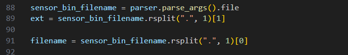

# IMU Form code

Data in `data` folder. MATLAB scripts in `analysis_scripts` folder. Python in `sensor_scripts` folder.

`ML_run.m` will take a file in the `data` folder and send it to be processed by `decode_sensor_bin.py`

`decode_sensor_bin.py` will call the rest of the python files, do some magic and output a csv file to the `data` folder.

`read_data.m` is called by `ML_run.m` to turn the csv into a MATLAB dataframe.

if you want to run the python code without MATLAB i believe you need to manually set `ext` to the file extension and `filename` to the file name, and the press run:

# Force Sensor files

In the folder called `force_sensor`

# OCTAVE/MATLAB files

files have been changed to work in MATLAB