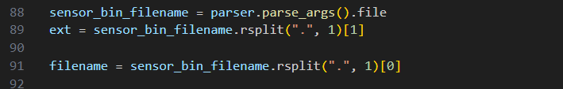
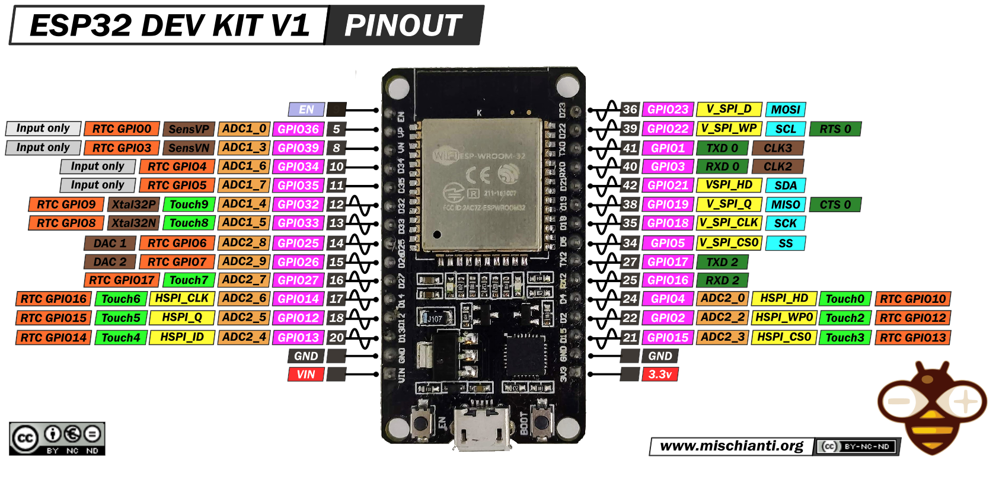
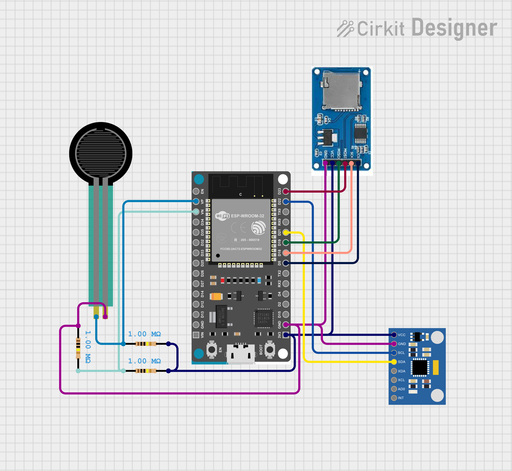

# FORM24 Archive

This directory contains prototype and experimental code developed during the creation of the FORM24 system.

## Directory Contents

The archive contains code from various stages of development and experimentation:

### ESP Button Tests
Code developed for testing button functionality with ESP32:
- `GPIO12_Button.ino`: Testing button input with debounce handling
- `RST_Button.ino`: Testing reset button functionality

### ESP IMU Prototypes
Various IMU-related prototypes and utilities:
- `battery.py` & `batteryfw.ino`: Battery monitoring experiments
- `bleClient.py`: Early Bluetooth client without GUI
- `bleimu.ino`: Basic BLE IMU transmission tests
- `find_imu_bus.ino`: Utility for detecting IMU devices
- `findblesmac.ino`: Utility for finding BLE MAC addresses
- `IMUCollect.py`: Early script for collecting/transmitting live IMU Bluetooth data

### Force Sensor Experiments
Early experiments using force sensors instead of IMUs:
- `arduino_logger.py`: Script for logging Arduino data
- `load_data_test.ipynb`: Notebook for testing data loading
- `save_to_csv.py`: Script for converting data to CSV

### FORM IMU
Initial data processing with code provided by FORM, including MATLAB processing:
- Data stored in the `data` folder
- MATLAB scripts in `analysis_scripts` folder
- Python scripts in `sensor_scripts` folder
- `imu_analysis.ipynb`: Notebook for IMU data analysis

#### MATLAB Data Processing Workflow
1. `ML_run.m` takes a file from the `data` folder and sends it to `decode_sensor_bin.py`
2. `decode_sensor_bin.py` processes the data and outputs a CSV file to the `data` folder
3. `read_data.m` is called by `ML_run.m` to convert the CSV into a MATLAB dataframe

#### Running Python Code Without MATLAB
To run the Python code without MATLAB:
1. Manually set `ext` to the file extension
2. Set `filename` to the file name
3. Run the script

## Hardware Reference

### Original ESP32 Development Board

### Original Force Sensor Circuit
The early prototype used a force sensor configuration before transitioning to IMUs:

## Historical Context

The development of FORM24 began with force sensor experiments before transitioning to IMU-based motion tracking. The code in this archive represents the evolution of the project through various hardware and software iterations.

## Note on Usage

This code is provided for reference only and is not actively maintained. For the current implementation of FORM24, please refer to the core code in the main directory.